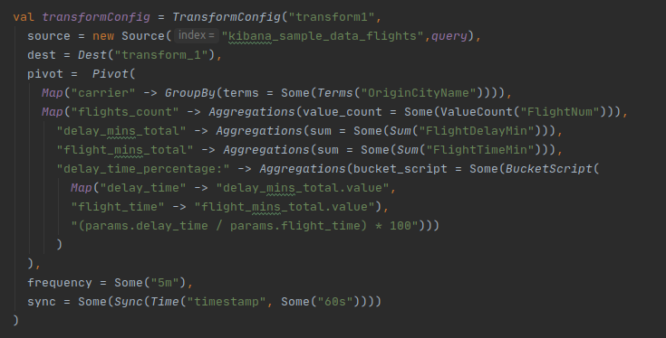
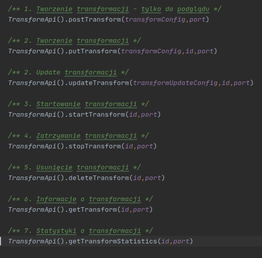
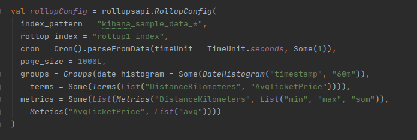
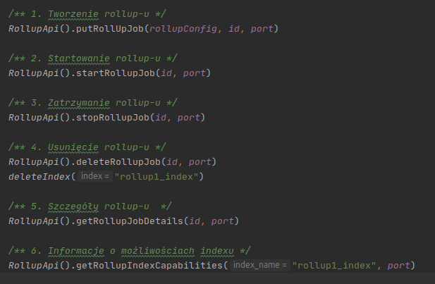

# ElasticSearch_Api

Create a query using classes for ElasticSearch's Rollup and Transform Api.

## Technologies 
* Scala 2.12.3
* ElastiSearch 7.8.1

## Installation
    
#### Clone    
Clone this repo to your local machine using 

#### Run docker
To install and run kafka image use docker file: 
    
```bash
sudo docker-compose -f docker-compose.yml up -d
```

## Content

The program creates a convenient environment for creating Rollup and Transform Api in ElasticSearch.
<br />Instead of saving the data in json format, the user enters it using classes.

#### Example Transform Api 



#### Example Transform Menu



#### Example Rollup Api 



#### Example Rollup Menu


